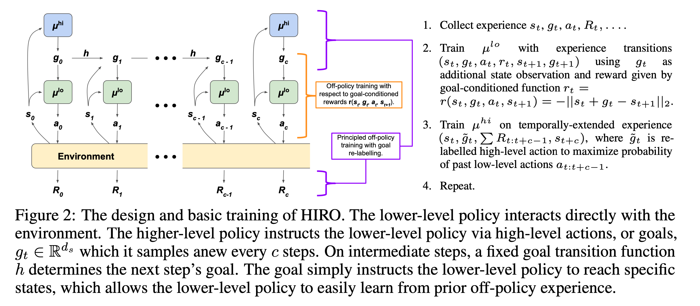

# Data-Efficient Hierarchical Reinforcement Learning

#### Link

[https://arxiv.org/abs/1805.08296](https://arxiv.org/abs/1805.08296)

#### Information

- Author/Institution : Ofir Nachum, Shixiang (Shane) Gu, Honglak Lee, Sergey Levine / **Google Brain**
- Conference/Journal : NeurIPS 2018
- Cited by 717 _(2023.07.09)_
- Submitted on 21 May 2018

## Abstract

Hierarchical RL은 복잡한 작업을 강화학습으로 해결하기 위해 자주 도입되는 방법 중 하나이다. 그러나 이렇게 강화학습을 계층적으로 설계하기 위해서는 각각의 작업별로 사람이 잘 구분해서 프로그래밍 하는 방법밖에어없기 때문에 실제 문제에 적용하기 어렵다. 이 논문에서는 여러 문제에 쉽게 적용할 수 있는 범용적인 HRL 알고리즘을 제안한다.

- 범용적인 HRL 학습방법을 제안하고, 이 방법으로 학습된 HIRO Agent을 보임
- off-policy를 사용하며 env와의 훨씬 적은 communication으로도 높은 성능을 달성
- goal state를 설정하는 higher-level policy, 실제로 action을 수행하는 Lower-level policy로 구분된다.

## comparison with Related Work

- embedding space에서 goal state와 현재 state를 비교하지 않고 raw form 그대로 사용한다.
- off-policy로 학습 가능하도록 알고리즘을 고안하였기 때문에 과거의 경험을 재활용 할 수 있어서 "data-efficient" 적이다.

## Key point

- higher-level policy가 수행하는 "action"을 **goal state**로 설정하고, lower-level policy가 action을 수행하면서 goal state에 가까워질 수록 좋은 reward를 받을 수 있도록 디자인한다.
- off-policy training이 가능하다!
  HRL의 문제점은, lower-level의 Policy가 higher-level policy에 영향을 받기 때문에 과거에 특정 high-level action에 의해 관찰되었던 sample로부터 동일한 low-level action을 이끌어 낼 수 없어서 유효한 experience set이 될 수 없었다.  
   이를 해결하기 위하여, 과거의 경험을 과거의 low-level action 중에서 그 확률을 maximize하기 위해 선택된 high-level action으로 re-labeling을 한다.

## Algorithm

## Formulation

- high-level policy : $\mu^{hi}$
  - observe state $s_t$
  - high-level action : sample a new goal state (= produces a high-level action) $g_t$
- low-level policy : $\mu^{lo}$
  - observe state $s_t$ and goal state $g_t$
- reward : $R_t$

$$
r(s_t, g_t, a_t, s_{t+1}) = -\|s_t+g_t-s_{t+1}\|_2
$$

**store experience**

- low-level : $(s_t, g_t, a_t, r_t, s_{t+1}, g_{t+1})$
- high-level : $(s_t, \tilde{g}_t, \sum_{\tau=t}^{\tau=t+c-1} R_t, s_{t+c})$

## Insight

이 논문 또한, high-policy에서 goal-state를 정의하고 low-policy에서 이를 실행하는 형식으로 구현되어있는 것을 확인할 수 있는데 우리 연구에 이를 적용한다면 점점 goal에 다가가는게 아니라 한번의 action으로 goal에 도달할 수가 있기 때문에 최대한 앞 frame에서 건너뛰게 될 것 같다.

또한, 이 경우에는 high에서는 네트워크만 관리하게 되는데 학습이 안될 듯 하다.
