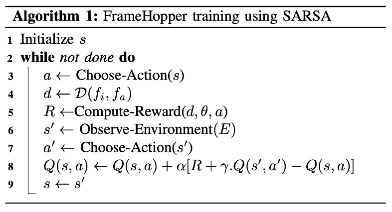

# FrameHopper: Selective Processing of Video Frames in Detection-driven Real-Time Video Analytics

#### Link

https://ieeexplore.ieee.org/abstract/document/9881637

#### Information

- Author/Institution : Md Adnan Arefeen, Sumaiya Tabassum Nimi, Md Yusuf Sarwar Uddin
- Conference/Journal : 2022 International Conference on Distributed Computing in Sensor Systems (DCOSS)
- Cited by 1 _(2023.07.09)_
- Submitted on 22 Mar 2022

## Abstract

통신 및 기술의 발전으로 앞으로는 많은 딥러닝, 그중에서도 Vision 관련 Task들이 네트워크의 End device에서 수행될 것으로 기대하고 있다. 이 때, 특히 object detection과 같은 경우에는 모든 frame을 처리하는 대신 중복되는 frame을 제거하여 사용하지 않음으로서 computing resource나 더 나아가서는 network의 throughput도 향상시킬 수 있다.

- RL을 사용하여 중요하지 않은 frame인 경우에는 skip하는 정책을 만든다.
- frame skip을 사용함으로서 end-device의 computing resource를 아낄 수 있고 network의 throughput을 향상시킬 수 있다.
- In this paper, we propose a reinforcement learning-based lightweight real-time video frame filtering technique named FrameHopper

## comparison with Related Work

- "강화학습"을 사용해서 어떤 frame을 처리하고 어떤 frame을 skip할지를 결정한다.
- 강화학습을 사용하여 학습하기 때문에 이전 frame들을 buffering하지 않고 바로 이전 frame과 현재 frame간의 차이 만을 활용한다.

## Key point

- **objective**
  - **maximize** the frame dropping rate (=$N-P$) _and_
  - **minimize** the error due to skipping $\sum E(f_i, \kappa(i))$
- 강화학습 (SARSA)
  => frame drop rate를 최대화 하고 error rate를 최소화하는 작업은 NP hard 문제($O(2^n-1$)이기 때문에 강화학습을 활용한다.
- state를 이전 frame과 비교해서 pixel의 변화된 개수의 비율로 나타내고, Deep-RL을 사용하지 못하기 때문에 Q-table에 적을 수 있는 방식으로 표현하기 위해 9차원의 벡터를 10개의 state로 clustering한다.

## Algorithm

- state : frame difference -> clustering
- action : skip-length (<=fps)
- reward

$$
R_t(k)= \begin{cases} \psi_1(k+1) &,error \le \theta \\ -\psi_2k &,error >\theta\end{cases}
$$

## Formulation

**objective**

$$
\min_{P \subseteq N} \sum_{f_i \in P} E(f_i, \kappa(i)) + \lambda |P|
$$

- total frame sequence : $N$
- total processing frame : $P$ (subset of $N$)
- frame f_i를 처리할 때, skip할 frame의 개수 : $\kappa(i)$
- error

  $$
  E(f_i, k) = \sum^k_{j=1} \mathcal D(f_i, f\_{i+j})
  $$

- frame difference  
   $$ \mathcal D(f_i, f_j) = 1 - F1(f_i, f_j) $$

  \* in object detection ...

  - precision

    $$
    precision=\frac{\#\ of\ hits}{\#\ of\ detected\ objects}
    $$

  - recall

    $$
    recall = \frac{\#\ of\ hits}{actual\ \#\ of\ detected\ objects}
    $$

  - F1-score

    $$
    F1=2\times \frac{precision \times recall}{precision + recall}
    $$

## Insight

- 우리 연구의 frame filtering 강화학습의 메인 아이디어는 해당 논문에서 나왔다.
- frame을 skip 한다는 아이디어를 채용했다.
- 단, 각 frame의 중요성을 계산하는 요소도 추가하였고 단순히 skip-length가 아닌 Lyapunov의 target arrival rate의 변화를 사용하여 네트워크 상태에 대한 reward를 조금 더 자세히 고려하려 한다.
