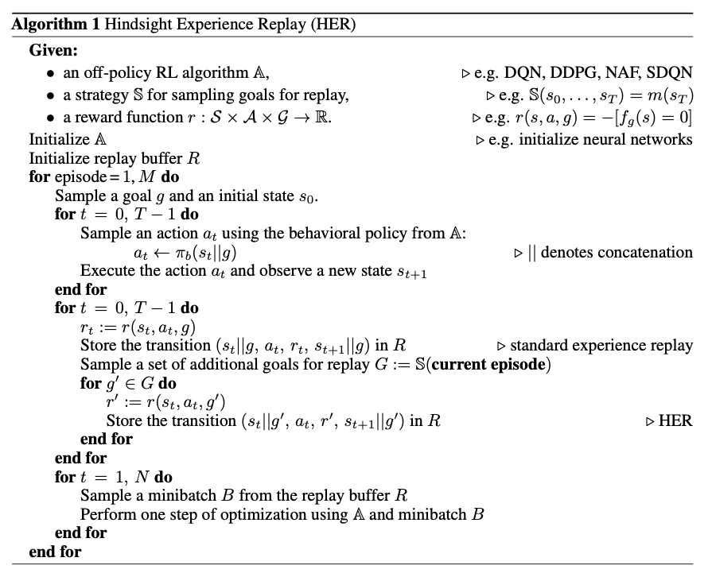

# Hindsight Experience Replay

#### Link

https://arxiv.org/abs/1707.01495

#### Information

- Author/Institution : Marcin Andrychowicz, Filip Wolski, Alex Ray, Jonas Schneider, Rachel Fong, Peter Welinder, Bob McGrew, Josh Tobin, Pieter Abbeel, Wojciech Zaremba / **OpenAI**
- Conference/Journal : Advances in Neural Information Processing Systems 30 (NIPS 2017)
- Cited by 2171 _(2023.07.10)_
- Submitted on 5 Jul 2017

## Abstract

대부분의 경우 reward가 0에 가깝고, 특정한 task를 성공해야만 reward가 발생하는 상황에서의 강화학습은 학습이 어렵다. 이 논문에서는 과거의 경험을 바탕으로 학습이 잘 될 수 있도록 하는 off-policy learning을 도입한다.

- Dealing with sparse rewards is one of the biggest challenges in RL.
- combine with any off-policy learning
- 과거의 실패로부터 배운다라는 직관적인 개념을 바탕으로 replay buffer를 활용해서 학습시킨다.

## comparison with Related Work

- goal state를 사용하기 때문에 UVFA 논문의 방법을 활용하고 있다.
- sparse reward 문제를 해결하기 위한 방법을 고안한다.

## Key point

로봇 팔을 제어해서 물건을 옮기거나 Montezuma's Revenge game과 같은 경우에는 긴 에피소드가 진행되고 나서야 하나의 goal을 달성할 수 있게 된다. 물건을 옮기는 경우에는 물건과 로봇팔 사이의 거리를 reward로 줄 수도 있지만, 이는 옳지 못한 방법이고 오히려 물건을 옮기는 것을 성공한 경우에만 1, 아닌 경우에는 0을 주는 sparse reward가 더 좋은 reward function이 될 수 있다. 하지만 이런 sparse reward에서는 대부분 0을 받기 때문에 학습이 빠르게 되지 않고 좋은 exploration 방법을 찾아야할 필요성이 있다.

이 논문에서 드는 예시 환경은 길이가 40인 bit sequence가 주어질 때, 달성하고자하는 sequence가 존재하고 action은 각각의 bit를 뒤집을지 말지로 결정이 된다. 만약 goal state와 현재 state가 동일한 경우에만 Reward를 준다면 절대로 이 긴 sequence를 처음에 맞출 수가 없기 때문에 일반적인 방법으로는 학습이 안된다.

> terminal state가 goal state와 다른 실패한 경험일지라도 **goal state를 실패한 terminal state로 변경** 함으로서 해당 experience를 유용한 experience로서 변경시킨다.

_example_  
goal이 $[1, 0, 1, 1, 1]$ 이라면,

- $S_{T} = [1, 1, 0, 1, 1]$ 는 terminal임에도 goal에 도달하지 못했기 때문에 실패한 experience라서 reward -1을 받게되고 쓸모없는 경험이 된다.
- 만약 goal을 $[1, 1, 0, 1, 1]$ 로 변경한 가짜 experience를 만든다면, model에게 성공한 경험을 제공할 수 있게 되기 때문에 학습이 가능해진다.

## Algorithm

## Insight

직관적인 아이디어에서 출발하여 강화학습에 도입했음에도 잘 들어맞는다는 것이 흥미로웠다.
그러나, 우리 연구는 "특정 objective에 대한 reward만 sparse"한 상황이고 계속 immediate reward가 제공되기 때문에 여기서 다루는 문제랑은 다른 느낌이 없지않아 있다 ...
