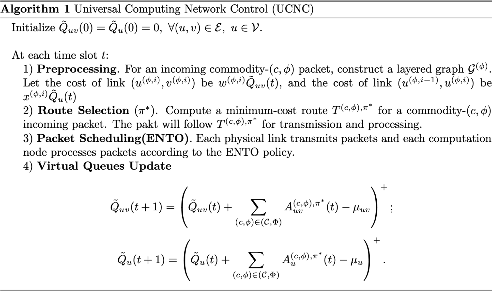

# Optimal Control of Distributed Computing Networks with Mixed-Cast Traffic Flows

#### Link

https://ieeexplore.ieee.org/document/8485956
https://ieeexplore.ieee.org/document/9404320  
\* 2가지 버전이 존재한다. 두번째 버전이 조금 더 자세한 증명이 포함되어있다.

#### Information

- Author/Institution : Jianan Zhang, Abhishek Sinha, Jaime Llorca, Antonia M. Tulino, Eytan Modiano
- Conference/Journal : IEEE INFOCOM 2018
- Cited by 20 _(2023.07.09)_
- Submitted on 11 October 2018

 

## Abstract

분산 컴퓨팅에서는 각각의 노드가 패킷을 전송하는 것 뿐만 아니라 필요한 service가 존재하는 경우 해당 노드의 컴퓨팅 자원을 사용해서 컴퓨팅을 수행하기도 한다. 때문에 일반적인 네트워크에서의 라우팅과는 다른 방식으로 접근해야한다. 본 논문에서는 분상 컴퓨팅 네트워크에서 패킷의 source - destination 경로와 처리 위치를 결정하는 정책을 개발한다. (UCDC)

- 분산 컴퓨팅 네트워크에서의 라우팅 경로를 한번에 결정하는 정책을 고안한다. (computing, communication constraint을 모두 만족)
- layered graph를 사용하여 packet processing에 대한 제약 또한 transmission에서 적용되는 link capacity에 대한 제약으로 표현한다.
- virtual system을 사용하여 처음에 source가 발생했을 때 최종 destination 까지의 경로를 한번에 결정하고 바꾸지 않는다.

 

## comparison with Related Work

선행연구와는 달리 uni-cast 뿐만 아니라 Multi-cast 라우팅 문제도 해결할 수 있도록 고안하였다.

 

## Key point

- layered graph를 이용하여 2가지의 서로 다른 제약을 하나의 제약으로 표현한다.
- virtual system을 이용하며, virtual system에서는 virtual queue가 strongly rate stable하고 이를 만족하면 physical system에서는 physical queue가 rate stable함을 보장한다. [Theorem 2, 3]

 

## Algorithm

virtual system; layered graph형태로 변환한다. 라우팅 문제는 각각의 노드를 연결하는 엣지의 가중치가 computing power와 queue backlog, 또는 data size와 queue backlog로 표현되는 그래프에서의 "최단거리"를 찾는 문제로 생각할 수 있기에 라우팅을 수행한다. 어떤 패킷을 전송할 것인지는 ENTO(_이동한 hop의 개수에 따른 우선순위 기반 라우팅_)을 따라 수행한다. virtual queue를 업데이트한다.

 

## Formulation

증명은 생략한다. (논문 참고)

### System Model

graph : network

$$
\mathcal G = (\mathcal V, \mathcal E)
$$

- $\mu_u$ : processing capacity of node $u$
- $\mu_{uv}$ : transmission capacity of link $(u,v)$

chain : service

$$
(\phi, i), i \in \{1, \cdots, M_\phi\}
$$

- $r^{(\phi, i)}$ : require computation resource
- $\xi^{(\phi, i)}$ : flow scaling factor

chain : traffic

$$
(c, \phi) \in (\mathcal C, \Phi)
$$

- $s_c$ : source node
- $\mathcal D_c$ : destination node(s)
- $A^{(c,\phi)}$ : \# of arrivals of commodity $(c, \phi)$ packets at node $s_c$ during timeslot $t$
- $\lambda^{(c, \phi)} = \mathbb E[A^{(c, \phi)}(t)]$ : average arrival flow rate of commodity $(c,\phi)$

### Layered graph & virtual system

layered graph :
여러 그래프의 계층적 구조로 이루어져있다. i번째 그래프는 i번째 service까지 처리된 노드의 routing path를 나타내고 있으며, i번째 그래프와 i+1번째 그래프를 연결하는 엣지는 i+1번째 service function을 특정 노드에서 수행함을 의미한다.

capacity constraints을 만족하는 flow rate

$$
\begin{align*} &\sum_{\phi\in\Phi,i\in\{0,\ldots,M_{\phi}\}}f_{u^{(\phi, i)}v^{(\phi,i)}}\leq\mu_{uv},\\ &\sum_{\phi\in\Phi,i\in\{1,\ldots,M_{\phi}\}}f_{u^{(\phi,i-1)}u^{(\phi,i)}}\leq\mu_{u}. \end{align*}
$$

virtual system에서의 표현 (flow scailing 때문에 아래 표현으로 바꿔야한다.)

- $x^{(\phi, i)} = r^{(\phi, i)}\prod^{i-1}_{j=1}\xi^{(\phi, j)}$ : require computation resource
- $w^{(\phi, i)} = \prod^{i}_{j=1}\xi^{(\phi, j)}$ : require computation resource

### capacity region

- $\mathcal T^{(c,\phi)}$ : set of all service chain pahts for $(c,\phi)$ packets
- $\lambda^{(c, \phi)}_k$ : average arrival flow rate of commodity $(c,\phi)$ for packet that use $k$'th path
  $$
  \begin{equation*} \lambda^{(c,\phi)}=\sum_{T_{k}^{(c,\phi)}\in \mathcal{T}^{(c,\phi)}}\lambda_{k}^{(c,\phi)},\forall(c,\phi)\in(\mathcal{C},\Phi) \end{equation*}
  $$
- link capacity
  $$
  \begin{align*} &\sum_{(k,i,c,\phi)\in \mathcal{S}_{uv}}w^{(\phi,i)}\lambda_{k}^{(c,\phi)}\leq\mu_{uv},\qquad \forall(u, v)\in \mathcal{E},\\ &\sum_{(k,i,c,\phi)\in \mathcal{S}_{u}}x^{(\phi,i)}\lambda_{k}^{(c,\phi)}\leq\mu_{u},\qquad\qquad \forall u\in \mathcal{V} \end{align*}
  $$

### Dynamic Routing

queueing dynamics in virtual system

$$
\begin{align*} A_{uv}^{(c,\phi),\pi}(t)=\sum_{(u^{(\phi,i)},v^{(\phi,i)})\in T^{(c,\phi)\pi}}w^{(\phi,i)}A^{(c,\phi)}(t) \\ \begin{equation*} A_{u}^{(c,\phi),\pi}(t)=\sum_{u(u^{(\phi,i-1),(\phi,i)})\in T^{(c,\phi),\pi}}x^{(\phi,i)}A^{(c,\phi)}(t) \end{equation*} \end{align*}
$$

$$
\begin{align*} &\tilde{Q}_{uv}(t+1) = \left(\tilde{Q}_{uv}(t)+\sum_{(c,\phi)\in(\mathcal{C},\Phi)}A_{uv}^{(c,\phi),\pi}(t)-\mu_{uv}\right)^{+}\\ &\tilde{Q}_{u}(t+1) = \left(\tilde{Q}_{u}(t)+\sum_{(c,\phi)\in(\mathcal{C},\Phi)}A_{u}^{(c,\phi),\pi}(t)-\mu_{u}\right)^{+} \end{align*}
$$

layered graph에서 엣지의 가중치의 합이 최소가 되도록 만드는 경로를 찾는다.

$$
\text{minimize} \\\ \\
\begin{align*} &\sum_{(u,v)\in \mathcal{E}}\tilde{Q}_{uv}(t)A_{uv}^{(c,\phi),\pi}(t)+\sum_{u\in \mathcal{V}}\tilde{Q}_{u}(t)A_{u}^{(c,\phi),\pi}(t)\\ &=A^{(c,\phi)}(t)(\sum_{u^{(\phi,i)},v^{(\phi,i)\in\mathcal{E}^{(\phi)}}}w^{(\phi,i)}\tilde{Q}_{uv}(t)1\{(u^{(\phi,i)},v^{(\phi,i)})\in T^{(c,\phi),\pi}\}\\ &+\sum_{(u^{(\phi,i-1)},u^{(\phi,i)\in\mathcal{E}^{(\phi)}}}x^{(\phi,i)}\tilde{Q}_{u}(t)1\{(u^{(\phi,i-1)},u^{(\phi,i)})\in T^{(c,\phi),\pi}\}).\tag{9} \end{align*}
$$

 

## Insight

우리 연구는, 이 논문을 baseline으로 보고있다. 단, 이 논문과의 차이점은 :

1. 현재 network 상태에 따라 현재 받아들일 수 있는 arrival rate를 계산하기 때문에 **flow control**을 수행한다.
2. (1)에 따라서 throughput에 대한 parameter를 추가하여 throughput에 대한 optimal을 보인다.
3. service chain을 DNN을 구성하는 각각의 layer를 inference하는 작업으로 표현하여 DNN partitioning에 대한 Task로 표현할 수 있다.
