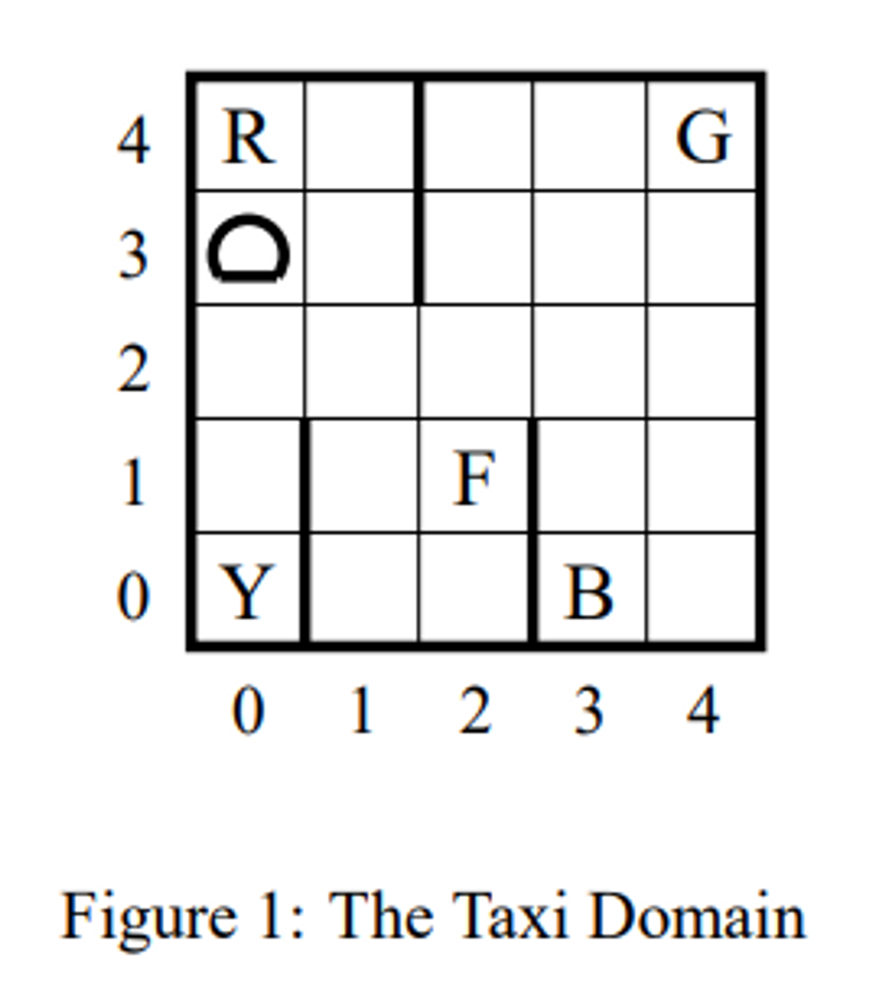
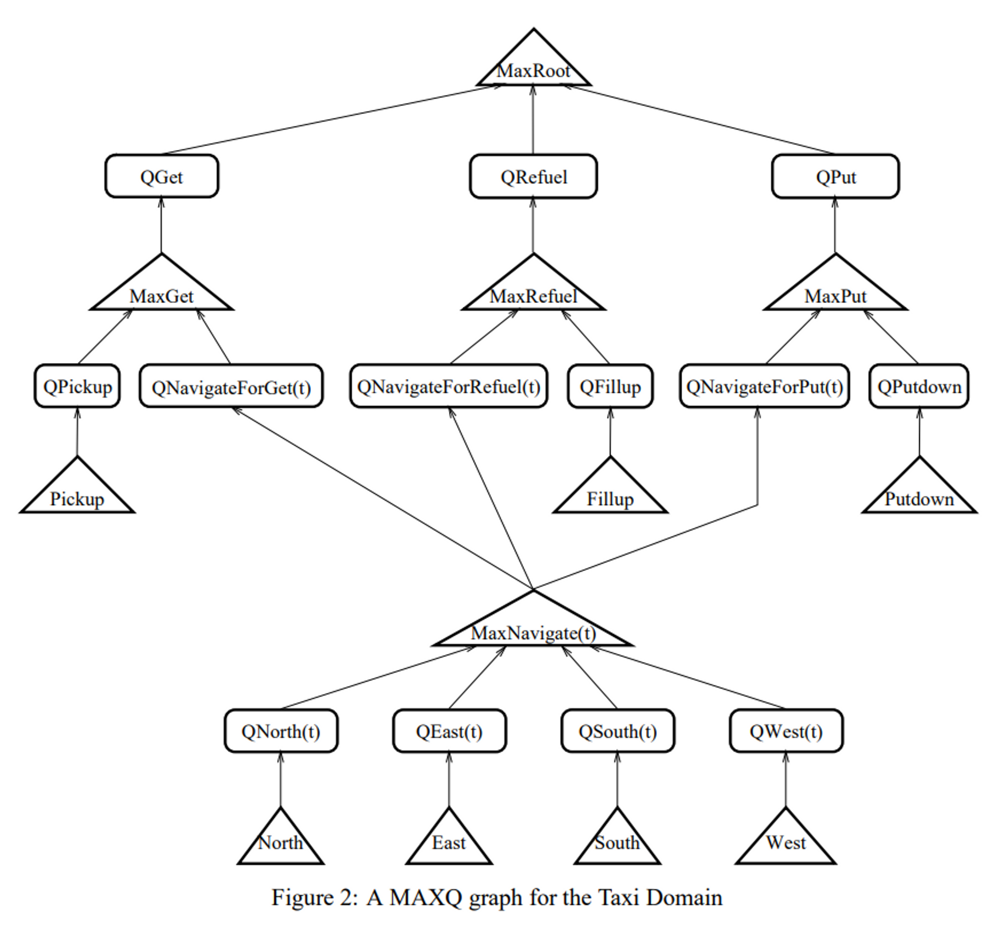
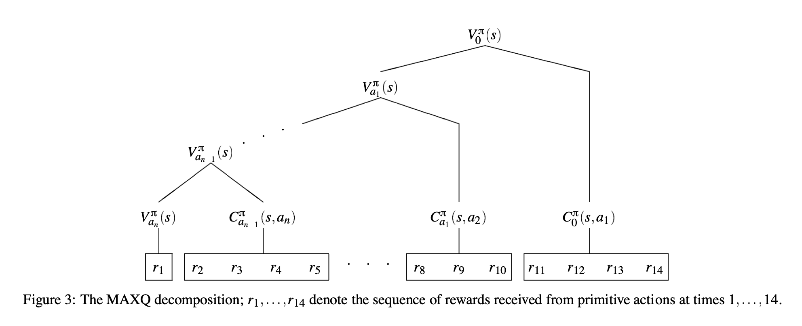

# The MAXQ Method for Hierarchical Reinforcement Learning

#### Link

[https://arxiv.org/abs/cs/9905014](https://arxiv.org/abs/cs/9905014)

#### Information

- Author/Institution : Thomas G. Dietterich
- Conference/Journal : Journal of artificial intelligence research
- Cited by 1974 _(2023.07.09)_
- Submitted on 21 May 1999

## Abstract

value function을 MAXQ decomposition으로 표현하는 Hierarchical Reinforcement Learning(계층적 강화학습)에 대해 다룬다. 계층적인 Q-learning은 optimal로 수렴하며 일반적인 Q-learning보다 더 빠르게 수렴한다.

- a subroutine hierarchy
- 강화학습에 사용되는 value function을 계층적; 재귀적 구조로 해석한다.

## comparison with Related Work

- 1995년부터 hierarchical RL에 대한 연구가 시작되었으며, 이전 연구들에서는 hierarchical을 programmer의 design으로 구성하고 각각의 subtask에 대한 optimal policy를 greedy하게 탐색하는 방법으로 수행되었다.
- MAXQ decomposition은 특정 Task에 의존적이지 않는 범용적인 방법이다.

## Key point

- 하나의 전체 episode에 대한 MDP를 여러개의 작은 subgoal이 있는 MDP로 나눈다.
- MAXQ 그래프로 MDP를 표현한다. (subroutine call graph)

## Problem

예시를 위해 사용하고 있는 문제는 아래와 같다.

- 8750개의 state
  $25 \times 14 \times 25$
  - 25개의 현재 Taxi의 위치
  - 14개의 연료 레벨 (init: $range(5,12)$, maximum: $14$)
  - 5개의 source와 5개의 destination의 조합 (=25개)
- 7개의 action
  - 4개의 이동 : `North`, `South`, `East`, `West`
  - 2개의 손님 탑승 / 하차 : `Pickup`, `Putdown`
  - 1개의 연료 : `Fillup`
- reward
  - 각 action에 대한 **immediate** reward -1
  - 손님을 목적지에 잘 옮겼을 경우 주어지는 **delayed** reward 20
  - 잘못된 위치에서 Pickup, Putdown을 할 때 주어지는 **delayed** reward -10
  - 연료가 없으면 -20의 reward를 받고 episode는 종료된다.

⇒ 이 문제는 “Get” the passenger, “Refuel” the taxi, “Put” the passenger라는 3개의 sub-task로 분리할 수 있다.

## Algorithm

전체 MDP에 대한 각각의 subtask를 표현하는 MDP $M_i$는 각각의 goal state $G_i ⊆ T_i$를 가지고 있으며, 각 subtask의 policy $\pi_i$는 goal state에 가까워지도록 학습된다. 따라서 각각의 sub task에 대한 optimal policy를 구할 수 있으며 *Hierarchical poliy*는 이런 policy들의 set으로 표현된다. $\pi = \{\pi_0, \cdots, \pi_n\}$

위의 예시 문제에 대한 MAXQ 그래프는 아래와 같다.

- Max node :
  - subtask를 나타낸다.
  - 해당 subtask를 위한 독립적인 reward
- Q node :
  - 부모노드가 나타내는 subtask를 수행하는 action을 나타낸다.
  - subtask 수행에 대한 종속적인 reward를 학습한다.

## Formulation

- $V^\pi_i(s)$ : expected cumulative reward for hierarchical policy $\pi$ with starting $s$ to enter terminate state $T_i$

$$
V^\pi_i(s) = V^\pi_a(s) + \sum_{s'}P_i(s'|s,a) V^\pi_i(s')
$$  

where $a=\pi_i(s)$

위와같이 즉각적인 reward와 함께 그 다음 subroutine 에서의 value function의 합의 형태로 value function을 decomposition 할 수 있다.

- $Q^\pi_i(s,a)$ : expected cumulative reward for MDP $M_i$ of performing action $a$ in state $s$ and then following the hierarchical policy $\pi$ there after.

$$
Q^\pi_i(s,a) = V^\pi_a(s) + C^\pi_i(s,a)
$$

$$
\text{where}\ V^\pi_i(s) = \begin{cases} Q^\pi_i(s, \pi_i(s)) & i\ \text{composite} \\ \sum_{s'}P(s'|s,i)R(s'|s,i) & i\ \text{primitive}\end{cases}
$$

$$
C^\pi_i(s,a) = \sum_{s'}P_i(s'|s,a) V^\pi_i(s')
$$

_decomposition_

## Insight

우리 문제에서 Lyapunov Guide에 의해 계산되는 network state에 대한 보상은 Lyapunov Guide가 주어지는 시점에서 계산되기 때문에 우리 문제는 immediate reward와 delayed reward를 모두 가지게 된다. 따라서 delayed reward를 해결할 수 있는 모델을 구상하기 위해 읽었던 논문이다.

이 논문에서의 예시를 보면 확실하게 하나의 MDP를 여러개의 sub-task 개념의 MDP로 분리할 수 있는 경우에 효과적으로 적용할 수 있으리라고 생각되는데, 우리 문제는 그렇게 나누는 것이 어렵기 때문에 적용하기가 어려울 것 같다.
